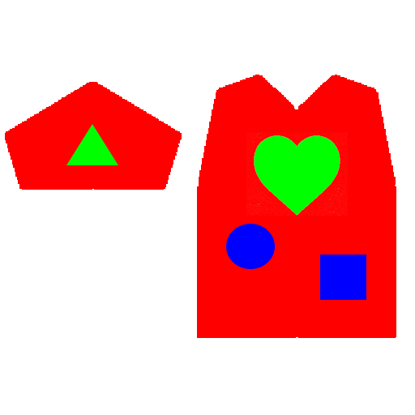

# MDPythonPatternMaker

画像の特定の色チャンネルを解析し、Marvelous Designer でそのまま実行可能なパターン生成用 Python スクリプトを書き出すツールです。

## 📋 主な機能
* **複数チャンネル解析**: 画像の「赤（R）」と「緑（G）/ 青（B）」の各成分を個別に解析し、パターンの外枠と内部パーツを同時に抽出します。
* **詳細なパラメータ調整**: 出力スケール、パスの平滑化、ノイズ除去、赤判定感度をリアルタイムに調整可能です。
* **ワンクリック出力**: 生成されたコードのコピーおよび `.py` ファイルとしての保存に対応しています。
* **永続化**: ウィンドウの表示サイズや位置、最後に使用したパラメータを次回起動時まで自動で記憶します。

## 💻 動作環境
* **OS**: Windows 10 / 11 (64-bit)
* **Framework**: .NET 9.0
* **Marvelous Designer**: Python API が利用可能なバージョン

## 🎨 読み込む画像の仕様
本ツールは色チャンネルごとに役割を分けて解析を行います。正確なパターンの生成には以下の仕様を推奨します。

* **外枠 (Outer Shapes)**:
    * 画像の **赤（R: 255）** 成分が含まれるエリアを外枠として抽出します。
* **内部パーツ (Internal Shapes)**:
    * 画像の **緑（G: 255）** または **青（B: 255）** 成分が含まれるエリアを内部パーツとして抽出します。
    * 緑と青はどちらも内部パーツとして扱われるため、色を使い分けることで視認性を確保した画像作成が可能です。
* **推奨ファイル形式**: `.png`（可逆圧縮のため、境界線の判定精度が安定します）。
* **推奨解像度**: 1024px 〜 2048px 程度（低すぎるとパスが粗くなります）。

### サンプル画像
`./Samples/SampleImage_01.png` に動作確認用のサンプル画像を同梱しています。まずはこの画像を読み込んで、変換動作やプレビューの表示をご確認ください。

## 🚀 使用方法
1. **画像の読み込み**: 「画像読み込み」ボタンから、パターンの元となる画像を選択します。
2. **パラメータ調整**:
    * **出力スケール**: MD上でのパターンサイズを調整します。
    * **滑らかさ**: パスの頂点数を調整します。値を大きくすると頂点が減り、滑らかな曲線になります。
    * **ノイズ除去**: 指定した面積以下の小さなパーツを自動的に除外します。
    * **赤判定感度**: 画像内の「赤色」として認識する閾値を調整します。
3. **変換**: 「変換」ボタンを押すと、プレビュー（赤：外枠、黄：内部パーツ）と Python コードが更新されます。
4. **出力**:
    * 「📋 コピー」でコードをクリップボードにコピーします。
    * 「💾 保存」で `.py` ファイルとして書き出します。初期ファイル名は `md_pattern_{元画像名}.py` となります。
5. **MDで実行**: Marvelous Designer のスクリプトエディタにコードを貼り付け、またはファイルを読み込んで実行してください。

## ⚠️ 免責事項
本ソフトウェアは現状有姿で提供されます。本ツールの使用によって生じた直接的・間接的な損害（データの損失、Marvelous Designer 上での動作不良、作成したパターンの不具合等）について、開発者は一切の責任を負いません。ご自身の責任においてご利用ください。

## 🤝 貢献 (Contribution)
バグの報告、機能改善の提案、またはドキュメントの修正などは GitHub の Issues までお気軽にお寄せください。プルリクエストも歓迎しております。

## 📜 ライセンス
本ソフトウェアは [MIT License] に基づいて公開されています。

### 使用ライブラリのライセンス
本プロジェクトでは、以下のオープンソースライブラリを使用しています。
* **OpenCvSharp4**: [Apache License 2.0]
* **Newtonsoft.Json**: [MIT License]
* **Extended WPF Toolkit**: [Microsoft Public License (Ms-PL)]

## 👤 開発者
* **ポジTA**
* **GitHub**: [posita33](https://github.com/posita33)- **X** : [@posita33](https://twitter.com/posita33)
